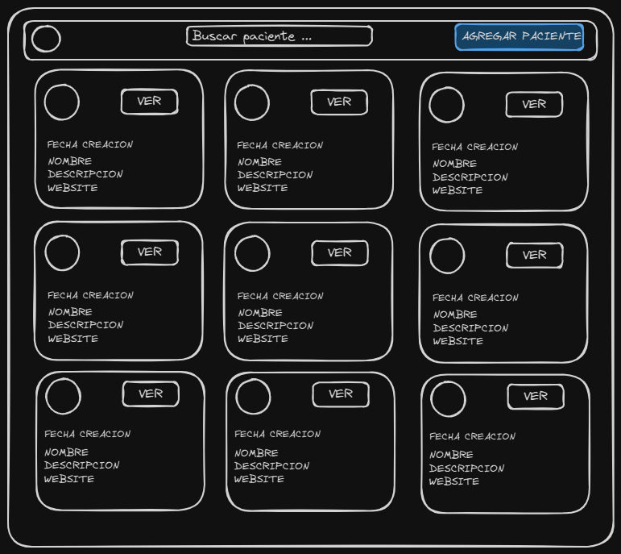
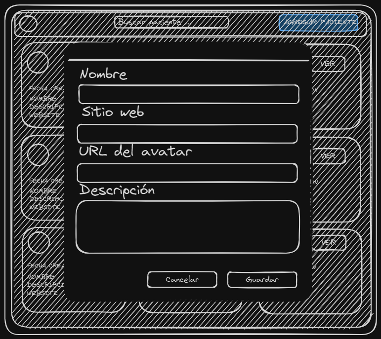

# Patient Management Dashboard

A modern, high-performance Single Page Application (SPA) for managing patient records. This project focuses on **scalability**, **maintainable architecture**, and a polished **User Experience (UX)**.

---


## Table of Contents

- [Getting Started](#getting-started)
  - [Installation](#installation)
  - [Running Locally and Sharing with Other Devices](#running-locally-and-sharing-with-other-devices)
  - [Accessing from Any Device (Network Mode)](#accessing-from-any-device-network-mode)
- [Project Overview](#project-overview)
- [Tech Stack](#tech-stack)
- [Architecture & Design Patterns](#architecture--design-patterns)
  - [Implemented Design Patterns](#implemented-design-patterns)
- [Key Features & Optimizations](#key-features--optimizations)

---

## Getting Started

### Installation

1.  Clone the repository:
    ```bash
    git clone https://github.com/MatiasMarchese/challenge-healthcare.git
    ```
2.  Navigate to the project directory:
    ```bash
    cd patient-dashboard
    ```
3.  Install dependencies:
     ```bash
    npm install
    ```

### Running Locally and Share with any device

To start the development server on your machine:

npm run dev
npm run -- --host (This enables access to the project from other devices on the same network, eliminating the need to clone the repository on each device.)

## Accessing from Any Device (Network Mode)

This allows you to view the application on **any device** connected to the same local network (Tablets, Smartphones, or other computers), eliminating the need to clone the repository on every machine to test it.

1.  Run the host command:
    ```bash
    npm run dev -- --host
    ```

2.  **Check the terminal output.** Look for the line(s) labeled `Network`. Copy the IP address provided there.

    *Example output:*
    ```text
      ➜  Local:   http://localhost:5173/
      ➜  Network: [http://192.168.137.1:5173/](http://192.168.137.1:5173/)  <-- Use this URL
      ➜  Network: [http://10.130.2.39:5173/](http://10.130.2.39:5173/)    <-- Or this one
    ```

3.  Enter that URL (including the port number) in the browser of your external device.

> **Note:** If multiple "Network" addresses appear, try the first one. If the page does not load, ensure your computer's Firewall allows connections on port 5173.

---


## Project Overview

This dashboard allows users to view, create, and edit patient data efficiently. It was built to demonstrate advanced frontend concepts such as **Server-State Management**, **Component Composition**, and **Performance Optimization** techniques.

## Design Process

Here are the initial wireframes created before development:






## Tech Stack

- **Core:** React 18, TypeScript, Vite.
- **State Management:** Redux Toolkit (RTK) & RTK Query.
- **Styling:** CSS Modules (BEM methodology adapted).

## Architecture & Design Patterns

The application follows a **Modular Component-Based Architecture**, adhering to **Flux** principles for predictable state flow.

### Implemented Design Patterns

1.  **Adapter Pattern (Data Transformation Layer):**
    -   Implemented a transformation layer to decouple the Frontend from the Backend.
    -   Raw API responses are normalized into clean Domain Models before reaching the Redux Store, ensuring the UI remains resilient to backend changes (e.g., snake_case to camelCase conversion).

2.  **Facade Pattern (Custom Hooks):**
    -   Used custom hooks (e.g., `usePatients`) to abstract the complexity of `RTK Query`.
    -   The UI components interact with a simplified API interface, remaining unaware of the underlying fetching library.

3.  **Container/Presentational Pattern:**
    -   **Smart Components (Containers):** Handle logic and state orchestration (e.g., `MainSection`).
    -   **Dumb Components (Presentational):** Purely visual, reusable components driven by props (e.g., `PatientCard`, `Modal`).

4.  **Observer Pattern:**
    -   Leveraged Redux's subscription model to automatically update the UI whenever the server state changes (e.g., after a mutation).

---

## Key Features & Optimizations

-   **Server-State Management:** Utilized **RTK Query** with automatic caching and tag-based invalidation. Lists update automatically upon creation/edition without manual refetches.
-   **Responsive Grid Layout:** A fluid CSS Grid implementation (`repeat(auto-fit, minmax(...))`) ensuring perfect rendering from Desktop to Mobile/Tablet.
-   **Interactive UI:**
    -   **Expandable Cards:** Smooth CSS transitions for revealing long text descriptions.
    -   **Toast Notifications:** Custom feedback system for success/error actions with auto-dismiss logic.
-   **Performance:**
    -   **Lazy Loading:** Native `loading="lazy"` on images to improve LCP (Largest Contentful Paint) and reduce page load times.
    -   **Client-Side Pagination:** Instant page transitions handled locally to minimize network latency.

